# Memory Lifecycle Tutorial

This tutorial explains the current external-memory system as an idea lifecycle:
how an idea becomes a card, how it is read, how it wins or loses the auction,
how evidence is credited back to it, and how it can be merged, ignored, decay
toward neutral, or be evicted.

The examples and figures below are from real tabular runs in this workspace:

- `outputs/memory-tabular-higgs-sota-r1-20260708_004349`
- `outputs/memory-tabular-higgs-sota-r2-20260708_004349`
- `outputs/memory-tabular-california-shared-higgs-memory-20260707_132039`
- `outputs/memory-tabular-california-shared-higgs-memory-copy2-20260707_132143`
- `SHARE_TABULAR_MEMORY*`
- `SHARE_TABULAR_MEMORY_HIGGS_SOTA_R*_20260708_004349`

The generated plot data lives next to the figures under `docs/assets/`.

## One Mental Model

External memory is a small library of mutation advice cards. A card is not
trusted because it sounds plausible. It earns trust only when it is selected,
rendered into the suggestion stage, cited by the final mutator, and then the
resulting child beats the expected no-card child in the same context.

Three loops run together:

1. The write loop creates and maintains cards.
2. The read loop chooses at most a few cards for a parent.
3. The evidence loop turns child outcomes into reputation and eviction signals.

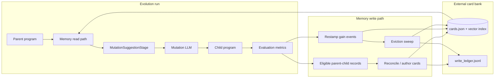

The important asymmetry is this:

- The read path is allowed to abstain. It should often show no card.
- The write path is allowed to delete. A harmful card should not keep returning
  as fresh optimistic advice.

## Configuration Map

Mainline runs still default to no external memory. External-memory reading only
happens when the pipeline can install `MemoryContextStage`.

| Arm | Read cards? | Write cards? | Typical use |
|---|---:|---:|---|
| `pipeline=guided memory=none` | no | no | no-memory baseline |
| `pipeline=guided memory=writer` | no | yes | seed a bank for later runs |
| `pipeline=memory_guided memory=reader checkpoint_dir=/path/to/bank` | yes | no | consume an existing bank |
| `pipeline=memory_guided memory=full memory/write=live checkpoint_dir=/shared/bank` | yes | yes | same-run read/write memory |
| `pipeline=memory_guided memory=full checkpoint_dir=/existing/bank` | yes | end only | read a prebuilt bank and flush new cards at shutdown |
| `pipeline=memory_guided memory=static memory.provider.levers_file=/path/to/levers.md` | fixed blocks | no | static-card ablation |

The current `memory=full` top-level defaults are:

| Component | Default | Why |
|---|---|---|
| Write cadence | `memory/write=end_of_run` | write once at shutdown unless overridden |
| Read policy | `memory/read_policy=recommended` | contextual bootstrap-EV bandit |
| Reputation | `BootstrapReputation(BDProximityReputation(...))` | per-BD-cell credit, global fallback |
| Auction | `BootstrapThompsonAuctioneer` | tail-aware EV bids and no-card-arm gate |
| Budget | `TopBidBudgeter` | when too many cards win, keep highest EV bid |
| Excluder | `LineageExcluder` | do not re-serve an already-applied ancestral card |
| Evictor | `CompositeEvictor(BirthFailureEvictor, HarmEvictor, PolicyNonViableEvictor)` | delete catastrophic births, later-use harm, and active-bank zombies |

`memory.reader.max_cards=1` is the external Memory Cards block budget by
default: it caps how many rendered cards reach `MutationSuggestionStage`. This
is not the same thing as retrieval width: the research agent can recall up to
`memory.store.config.research.max_cards=10` cards before the auction and budget
reduce the slate.

Same-run memory effects require adding `memory/write=live`. Without that,
`memory=full` writes at the end of the run. That is useful only when
`checkpoint_dir` points at an existing/prebuilt bank to read during the run. The
default per-run bank is empty at launch, so the config validator rejects
`pipeline=memory_guided memory=full` with default `checkpoint_dir` unless
`memory/write=live` is enabled. The 10% randomized no-card control is a
`pipeline=memory_guided` default (`pipeline_builder.no_card_control_probability`)
rather than a `memory=full` component.

## Minimum Working Config

Every run still needs a problem. The default memory LLM is `memory/llm=gemini`,
which requires the normal LLM credentials for this repo, for example
`OPENROUTER_API_KEY` when using the OpenRouter Gemini route. For local inference,
override `memory/llm` the same way you override the main run LLM.

```bash
# True no-memory control.
python run.py problem.name=<problem> pipeline=guided memory=none

# Build a reusable bank without reading from it.
python run.py problem.name=<problem> \
  pipeline=guided memory=writer checkpoint_dir=/abs/banks/<problem>

# Read an existing bank without writing new evidence.
python run.py problem.name=<problem> \
  pipeline=memory_guided memory=reader checkpoint_dir=/abs/banks/<problem>

# Same-run dynamic memory with an isolated per-run bank.
python run.py problem.name=<problem> \
  pipeline=memory_guided memory=full memory/write=live

# Static curated-card ablation.
python run.py problem.name=<problem> \
  pipeline=memory_guided memory=static \
  memory.provider.levers_file=/abs/path/to/levers.md
```

Use one shared bank only for compatible tasks: same problem semantics, primary
metric meaning/direction/scale, compatible `significant_change`, behavior-space
meaning, and embedding configuration. For a first smoke test, omit
`checkpoint_dir` and use the isolated per-run live setup above. For a multi-run
experiment, set `checkpoint_dir=/abs/banks/<name>` so all runs share the same
`cards.json` and vector index.

The main override decisions are:

| Override | Default / recommendation | When to change |
|---|---|---|
| `problem.name` | required | Always set it. |
| `checkpoint_dir` | per-run Hydra output memory dir | Set an absolute path only when sharing or reusing a bank. |
| `memory/write` | `end_of_run` under `memory=full` | Use `live` for same-run read/write effects. |
| `memory/read_policy` | `recommended` under `memory=full` | Use `portable` when there is no single shared behavior space. |
| `memory.reader.max_cards` | `1` | Increase only if you intentionally want multiple external cards in the suggestion stage. |
| `memory/llm` | `gemini` | Override for local LiteLLM or another memory/retrieval model. |

## Recommended Settings Explained

For a single-island tabular/BD run where you want the current best dynamic
memory behavior, use:

```bash
python run.py \
  pipeline=memory_guided \
  memory=full \
  memory/write=live \
  memory/read_policy=recommended \
  memory/evictor=recommended \
  checkpoint_dir=/path/to/shared_bank
```

This expands into the following system.

| Component | Current recommended setting | What it does | Why it is needed | What you see on real cards |
|---|---|---|---|---|
| Store | `LocalMemoryStore` | Owns `cards.json`, Chroma index, and research agent | One shared object lets writer updates become visible to later reads | `MEMORY_STORE_WRITE` rows and growing/merging cards in `cards.json` |
| Research width | `default_top_k=10`, `research.max_cards=10` | Gives the agentic retrieval loop enough candidates for the auction | A one-card suggestion budget still needs a wider candidate pool | Higgs R1 averaged 3.10 candidates per read after retrieval/filtering |
| Suggestion-stage card budget | `memory.reader.max_cards=1` | Caps rendered external cards passed into `MutationSuggestionStage` | Keeps the card-derived suggestion source focused and makes credit cleaner | `MEMORY_BUDGET_CAP` appears when multiple cards win |
| Shortlister | `BootstrapFusedRankingShortlister` | Benches weak warm cards before research, then may post-filter/rank the researched result | Prevents known weak cards from occupying digest/research slots | Warm non-positive cards vanish before prompt rendering |
| Bench floor | `rep_floor_quantile=0.4` | Drops bottom warm-card pessimistic-EV quantile before research | Self-normalized bank cleanup without a metric-specific threshold | Bad warm cards become less visible even before eviction |
| Reputation | `BootstrapReputation(BDProximityReputation)` | Computes contextual posterior and bootstrap EV from gain events | A card can help one BD region and hurt another | Same card can bid differently depending on parent metrics |
| Cold prior | `Beta(3, 3)` | Neutral posterior for cards with no non-founding evidence | Cold cards need exploration without being treated as winners | Founding-only cards remain explorable but not trusted |
| EV staleness | `half_life_cycles=1.0` | Downweights old EV evidence by bank-cycle age | Old evidence should fade relative to a changing bank | Stale known deltas bid closer to zero |
| Auction | `BootstrapThompsonAuctioneer` | Samples EV bids and gates against the no-card arm | Handles uncertainty, left-tail loss, and abstention | Higgs R1 rejected 608/1200 reads at auction |
| EV floor | `ev_floor_quantile=0.765` | Requires bids to be in the high part of the round's own bid distribution | Avoids hardcoded gain deltas and limits low-value injections | Candidate can be retrieved but still fail the auction |
| Budget | `TopBidBudgeter` | Keeps highest realized EV bid when too many cards win | The external card block can hold fewer cards than auction winners | Budget rows show dropped winners by bid |
| Excluder | `LineageExcluder` | Filters cards actually applied by ancestors | Avoids repeatedly reusing the same idea down one lineage | Descendants do not re-see cited/applied cards |
| No-card control | `pipeline_builder.no_card_control_probability=0.10` | Randomly withholds the external Memory Cards block after reader selection | Provides fair baseline rows for attribution | Some reader-selected slates produce no external card exposure and `memory_no_card_control=True` |
| Writer cadence | `memory/write=live` | Runs live sweeps every 10 ingestor sweeps that landed programs, capped at 24 programs per sweep, plus final flush | Same-run memory needs cards before the run ends | Later read events can retrieve cards written earlier in the run |
| Dedup | `DedupPolicy(online_top_k=5, max_cards_per_diff=3, consolidation_k=5)` | Uses LLM reconcile and consolidation, not distance thresholds | Prose/card embeddings are not reliable enough for a fixed duplicate cutoff | Ledger has many `merged` and `updated` rows |
| Program exemplars | `enabled=true`, `top_k_per_refresh=4`, `max_cards=12` | Adds bounded top-program cards | Some lessons are best represented by a concrete program exemplar | Banks contain `kind=program` cards with fitness/code hash |
| Birth eviction | `BirthFailureEvictor(scale_multiplier=2.0)` | Deletes catastrophic founding-loss cards | Prevents severe origin failures from acting like neutral cold advice | Ledger records `rejected_harm` or `evicted` near admission/sweep |
| Harm eviction | `HarmEvictor` | Deletes cards whose later-use posterior is confidently harmful | Conservative backstop for repeated failures, usually from batched evidence or less conservative policies | Ledger reason says `injection posterior confidently harmful` |
| Policy non-viable eviction | `PolicyNonViableEvictor(neutral_gain=${memory.neutral_gain})` | Deletes warm cards with non-positive active-policy EV and no positive direct baseline-adjusted gain | Main zombie-card fix: one bad/non-use sample can make a card unattractive without waiting for 3 bad selections | Ledger reason says `policy non-viable`, not confidently harmful |

The recommended settings are conservative in one important way: they do not
delete every cold card. A card with no later-use evidence can remain in the bank,
but it must pass retrieval, EV, no-card-arm, and budget gates before it affects a
mutation. Once it is rendered into the Memory Cards block of a writer-enabled
run, it should become measurable through direct use, unused exposure, or
invalid-child evidence. In reader-only or static runs, the child can still be
influenced, but persistent card evidence is not written by that run.

Live writing is also bounded. `memory/write=live` installs
`LiveMemoryRefreshHook`, which runs after every 10 ingestor sweeps that landed at
least one program, processes at most 24 programs per sweep by default, and uses
`post_step_hook_timeout_s=900`. The normal end-of-run flush still runs.

### What settings do to one real card

Take `mem-e1c0bd7de695` from the Higgs SOTA R1 bank. It is a `log(1+x)` feature
insight with 8 stored events: 1 founding event, 4 direct events, and 3 unused
events.

The recommended stack treats it like this:

1. The founding event is preserved for audit but excluded from posterior and EV.
2. The 4 direct events become signed EV support and Beta posterior evidence.
3. The 3 unused events become zero-support exposure failures.
4. Bootstrap EV samples from direct gains, zero exposure atoms, and a neutral
   pseudo-event.
5. If its pessimistic EV is low relative to the bank, the shortlister benches it.
6. If it is still a candidate, the auction samples a bid and compares it to the
   no-card arm.
7. If the active policy prices it at or below the no-card neutral point and it
   has no positive direct baseline-adjusted use, `PolicyNonViableEvictor`
   removes it as active-bank hygiene rather than as a harm verdict.
8. If later use accumulates enough repeated failures before policy retirement,
   `HarmEvictor` deletes it as confidently harmful.

This is the intended lifecycle: a plausible idea is neither trusted forever nor
deleted immediately. It keeps competing only to the extent its evidence supports
future use.

## End-To-End Idea State Machine

This is the complete lifecycle of an idea card. Not every card visits every
state.

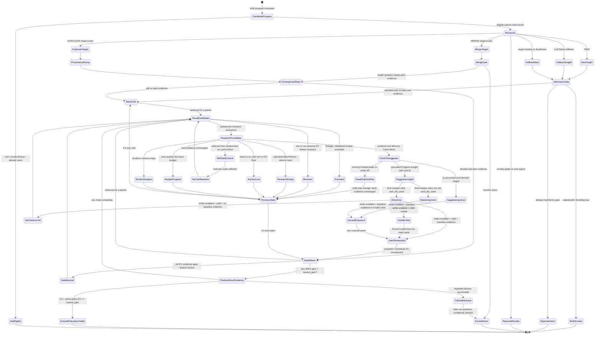

## Write Side: How Cards Are Born

The write path is orchestrated by `MemoryWriter`. One sweep does this:

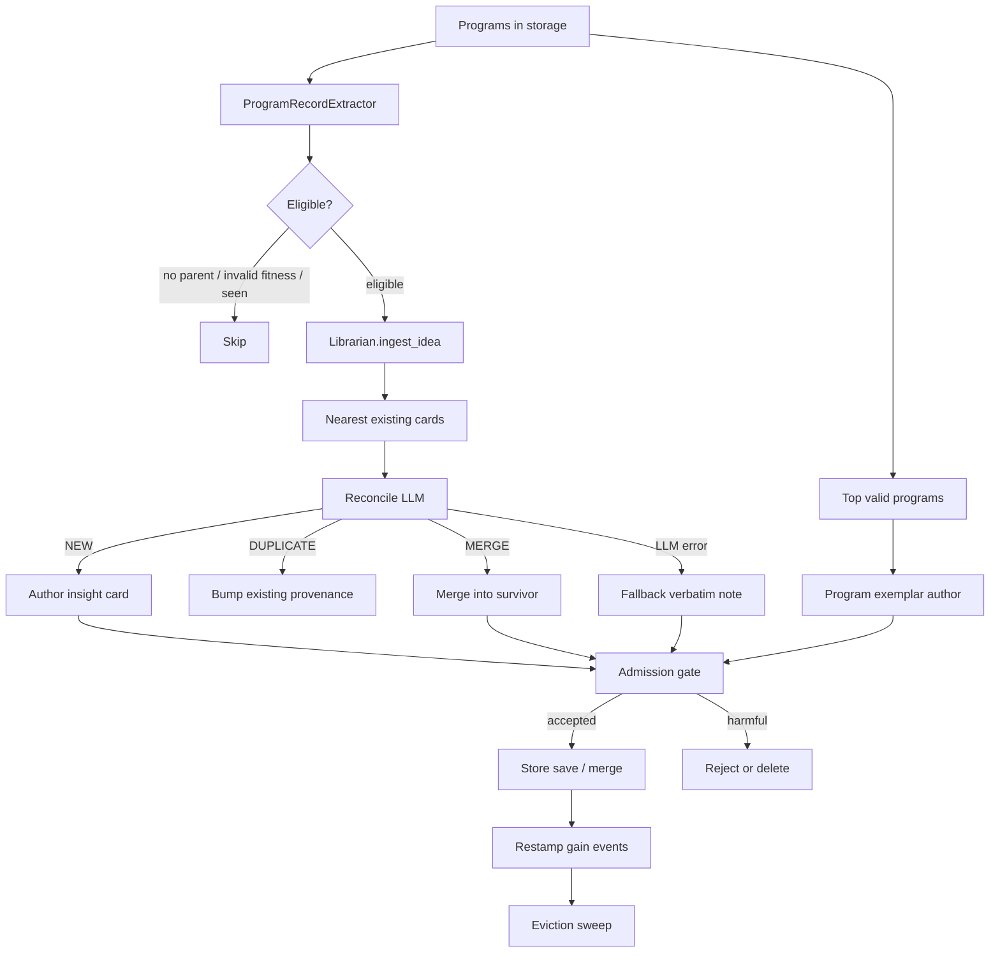

There are two card kinds:

- `kind=insight`: a distilled idea such as "use invariant mass features" or
  "avoid leakage in calibration".
- `kind=program`: a top program exemplar with `program_id`, `fitness`, and a
  normalized `code_sha256`. By default the code itself is not stored on the card
  (`store_code=false`) to keep the bank compact.

### Real write outcomes

The tabular banks show that most write activity is not simply "add card". The
system is constantly merging, updating, and evicting.

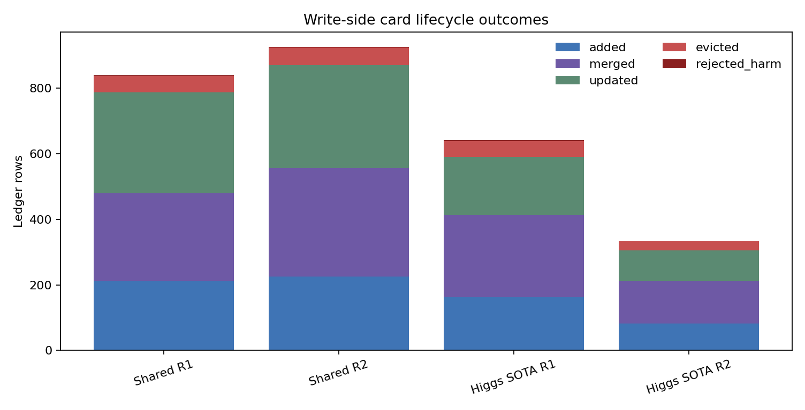

For example, `SHARE_TABULAR_MEMORY_HIGGS_SOTA_R1_20260708_004349/write_ledger.jsonl`
contains 642 ledger rows: 163 `added`, 250 `merged`, 178 `updated`, 48
`evicted`, and 3 `rejected_harm`.

### Birth branches

| Birth case | What happens | Why |
|---|---|---|
| Child is not eligible | No card is authored | Root programs, invalid fitness, missing fitness, or already-seen children do not pay memory LLM cost. |
| Reconcile says `NEW` | New insight card is authored and admitted | This is a distinct idea over the parent-child diff. |
| Exact description twin exists | Existing insight provenance is bumped before novelty/admission | A repeated normalized prose card should not mint a second id or duplicate founding evidence. |
| Reconcile says `DUPLICATE` and target exists | Existing insight provenance is bumped; evidence state is unchanged | The same idea already exists; the bank should not grow or reset evidence. |
| Reconcile says `DUPLICATE` but target is missing/disallowed | The writer can fall back to fresh admission | A stale LLM target should not silently drop a useful new idea. |
| Reconcile says `MERGE` and target exists | New content is folded into an existing insight; the survivor keeps prior evidence | Similar ideas become one stronger survivor with `absorbed_ids`, without turning a warm target cold. |
| Merge union is harmful | The target can be deleted/tombstoned and the incoming card rejected | A harmful merge should not survive under the old id. |
| Reconcile LLM fails | Fallback insight can be admitted, after exact-twin check | Memory should degrade, not break the run, but repeated fallback prose still dedups. |
| Idea ingest times out | Partial landed cards are kept; the child record is retried later | A stalled memory LLM call should not block the sweep or permanently drop the child. |
| Program is top-fitness | Program exemplar card may be authored | Concrete high-performing programs are kept separately from prose insights. |
| Exemplar authoring fails or times out | Exemplar is skipped | A stalled exemplar LLM call should not freeze the writer. |
| Exemplar code hash already exists | Equal/worse same-code exemplar is discarded; strictly better twin replaces the older one | Program exemplars dedup by normalized code identity, not prose similarity. |
| Exemplar cap exceeded | Worst extra exemplar is retired with a non-harm ledger update | `program_exemplars.max_cards=12` bounds exemplar memory. |
| Exemplar id was tombstoned | Authoring is skipped | Harm-deleted cards should not churn back into the bank during the same run. |
| Catastrophic founding loss | Card is deleted at birth | See birth-failure eviction below. |

One subtle merge rule matters for statistics: when a fresh incoming card is
merged into an existing insight, the incoming founding event is not used to make
the survivor look warm. The survivor keeps its already-banked founding/use
events, and later restamps can re-alias children that cited absorbed ids.

## Bad Initial Cards

A card can be born from a child that got worse. The system deliberately
distinguishes three cases.

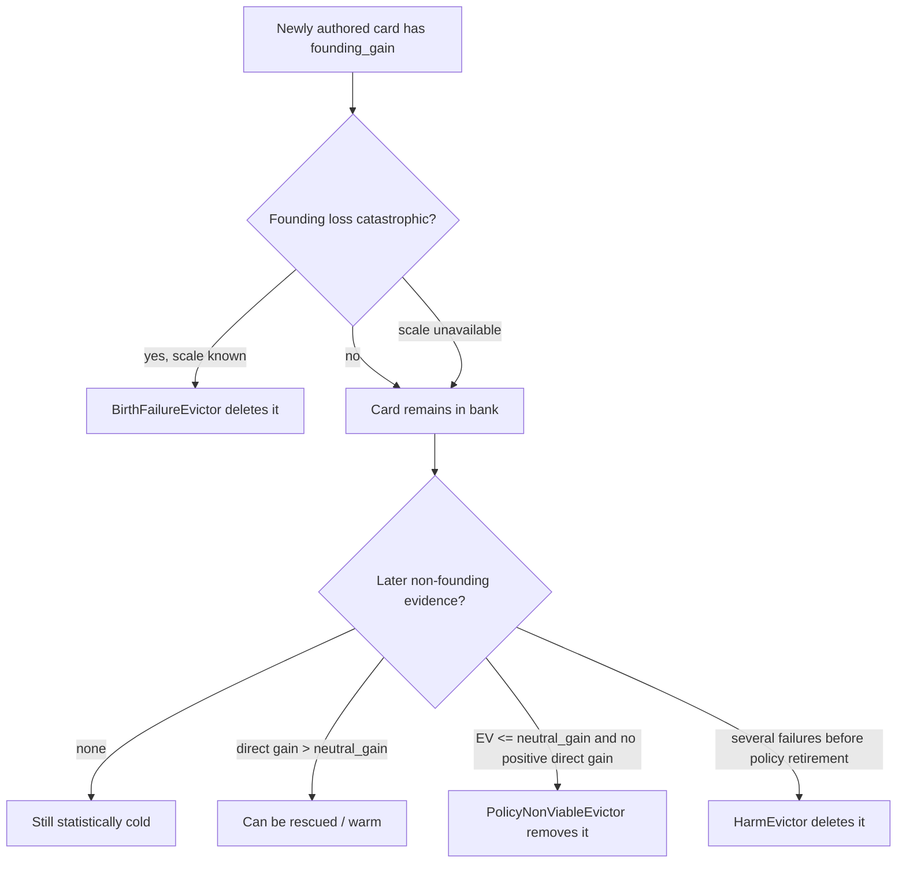

The founding event is the raw child-minus-base delta of the child that produced
the card. It is saved for audit and birth-failure eviction, but it is not used
as later-use evidence in the reputation posterior. This matters:

- A founding-only positive card is still cold statistically.
- A founding-only mildly negative card is still cold statistically.
- A founding-only catastrophically negative card can be deleted immediately.
- A later single negative or unused exposure usually does not need to become a
  "confidently harmful" posterior. If the active policy EV is non-positive and
  there is no positive direct baseline-adjusted use, `PolicyNonViableEvictor`
  can remove it as bank hygiene.

Concretely, founding events are excluded from:

- Beta posterior counts,
- bootstrap EV support,
- renderer confidence,
- later-use harm or policy-non-viable eviction.

They are included in:

- the persisted card audit trail,
- merge preservation,
- `BirthFailureEvictor`.

The default birth-failure rule is:

```text
evict if founding_gain <= -2.0 * primary_metric.significant_change
unless later direct evidence has already rescued it
```

If the task has no `significant_change` scale and no explicit eviction scale,
birth-failure eviction is disabled rather than using a hardcoded metric delta.

## Read Side: How Cards Compete To Be Rendered

External memory is read by `MemoryContextStage`, installed only by
`pipeline=memory_guided`.

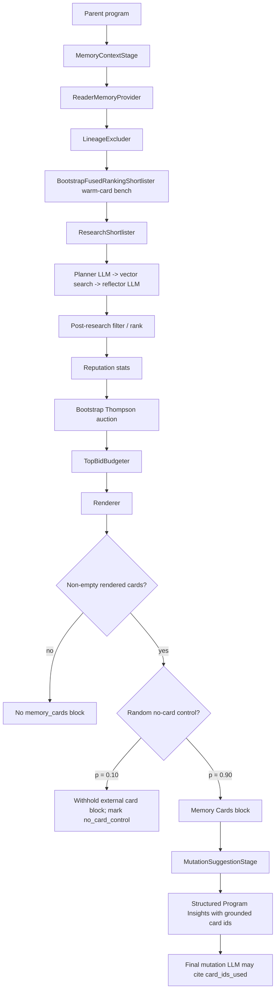

Two details are easy to miss:

1. External card text goes to `MutationSuggestionStage.memory_cards`, not
   directly to the final mutation context. The suggestion stage turns descriptive
   memory into actionable `ProgramInsights`; the final mutation LLM sees those
   insights, and can credit a card only by copying a grounded `card: <id>` into
   `card_ids_used`.
2. Agentic retrieval is not plain nearest-neighbor top-k. The planner LLM writes
   scoped vector queries, the index returns hits, and the reflector LLM selects
   candidate card ids. That candidate slate is then priced by reputation,
   auction, budget, and renderer.
3. A card can be known to the bank but never influence a child. It can be
   excluded by lineage/absorbed-id aliasing, benched before research, hidden by
   the digest/payload caps, missed by retrieval, lose the auction, lose the
   card-block budget, fail to render, or be randomly withheld for the no-card
   control.

### Real read funnel

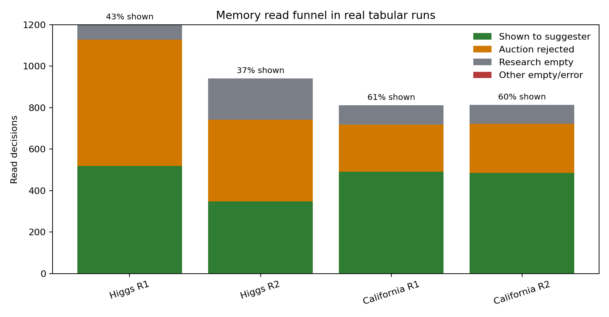

In the Higgs SOTA R1 run:

- 1,200 read decisions were made.
- 520 ended with a card shown to the suggester.
- 608 reached the auction but were rejected.
- 72 were research-empty.
- The mean candidate count was 3.10, and the mean auction winner count was 0.55.

This is expected. A healthy memory system should abstain often; otherwise bad
cards overflow the suggestion stage. Suspicious cases are different: a non-empty
bank with persistent `research_empty` suggests retrieval/index/task mismatch,
while many candidates with persistent `auction_rejected` is often just the
safety gate doing its job.

## Selection Probabilities

There are two kinds of probability in the read path.

### Explicit randomized control probability

`pipeline_builder.no_card_control_probability=0.10` means:

```text
if at least one card was rendered by the reader:
    with probability 0.10:
        clear memory_selected_idea_ids
        return an empty external Memory Cards block
        mark the parent memory_no_card_control=True
```

This produces fair rows for estimating "what would have happened without a
card when the system thought a card was worth showing?" It withholds only the
external card block. The normal parent code, metrics, intra-memory summary,
ancestral trail, and non-card suggestions can still appear in the prompts.

### Bandit sampling probabilities

The auction itself is stochastic. A known card draws from its posterior and
from its bootstrap EV support. It must pass:

1. A positive EV sign gate.
2. A round-relative EV floor.
3. A sampled no-card-arm gate: the auction draws from its fixed
   `baseline_prior` (`Beta(3, 3)` by default) and Sidak-adjusts that gate over
   the eligible slate.
4. The external card-block budget.

So there is no single fixed "card selection probability". It depends on the
retrieved slate, the card posterior, the current bank, the parent's BD cell, and
the random Thompson draws.

This auction no-card arm is separate from the fitted no-card progress baseline
below. The auction arm is a read-time abstention prior; the fitted progress
baseline is a write-time estimate used to score card outcomes.

## Cold State

"Cold" means the card has no non-founding EV support in the reputation view that
will be used for this decision. Under `BDProximityReputation`, a parent cell with
no local non-founding support delegates to global evidence. The card is truly
cold only when that fallback is cold too. In-cell unused/invalid zero exposure is
real local evidence and blocks fallback.

| Card evidence | Posterior used by auction | EV support | Default behavior |
|---|---|---|---|
| No events | `Beta(3, 3)` cold prior | borrowed cold gain scale | Explorable, but must still beat EV and no-card-arm gates |
| Founding only | `Beta(3, 3)` cold prior | borrowed cold gain scale | Same as cold; founding is origin/audit evidence only |
| Only unused/invalid later exposures | posterior includes forced failures | zero support | No longer cold; likely benched or auction-rejected |
| Positive later direct use | posterior warms positive | raw positive deltas plus zero pseudo-event | Can win more often |
| Mixed later direct use | posterior and EV reflect sign and magnitude | raw mixed deltas plus zero pseudo-event | Fat losses lower EV bids |
| BD cell has no non-founding support, global evidence exists | fallback global posterior | fallback global deltas | Contextual reputation does not invent local evidence |
| BD cell has only unused/invalid zero exposure | local forced-failure posterior | zero support | No global fallback; the local exposure is evidence |

Cold cards are not automatically evicted. This is intentional: no outcome has
measured them yet. The system controls them at read time with neutral priors,
retrieval ranking, the EV floor, and the no-card arm. Once a cold card is
rendered in a writer-enabled run, it should stop being zombie-like: a cited use
gives direct evidence, and an ignored card gets an unused exposure event once
baseline evidence exists.

## No-Card Progress Baselines

The writer does not credit a card with raw child-minus-parent improvement. It
subtracts expected no-card progress first.

For a used card:

```text
oriented_delta = child_fitness - base_fitness        # higher-is-better tasks
gain = (oriented_delta - no_card_baseline(context)) / number_of_used_cards
```

For lower-is-better tasks the oriented delta is reversed.

This fitted baseline is not the auction's no-card arm. It is used only when the
writer restamps gain events. It is fitted from children that had a frozen base
parent and no selected card ids. If randomized no-card controls exist anywhere
in the fitting cohort, those controls are preferred globally. If not, ordinary
no-card rows are used. The estimator is pluggable:

- `GlobalNoCardBaseline` uses one global median.
- `BDProximityReputation.fit_no_card_baseline()` uses per-BD-cell medians with a
  global fallback.
- `BootstrapReputation` delegates the baseline fit to its inner reputation.

That means `memory=full memory/read_policy=recommended` is not hardcoded global
aggregation: its writer shares the same contextual `BootstrapReputation` /
`BDProximityReputation` object, so no-card progress can be BD-cell local with a
global fallback. By contrast, `memory=writer` defaults to `beta_binomial`, whose
baseline fit is global unless you explicitly override the reputation/baseline
estimator.

The control preference is global before BD partitioning. If a run has any
randomized no-card controls, ordinary no-card rows are ignored for the baseline;
a BD cell with no control rows falls back to the global median of the controls,
not to same-cell ordinary rows.

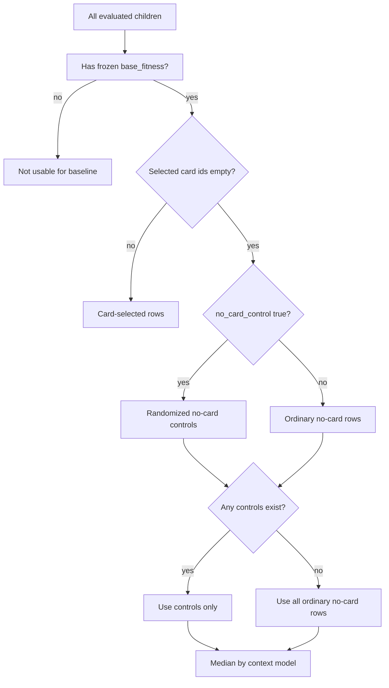

### Real baseline cohorts

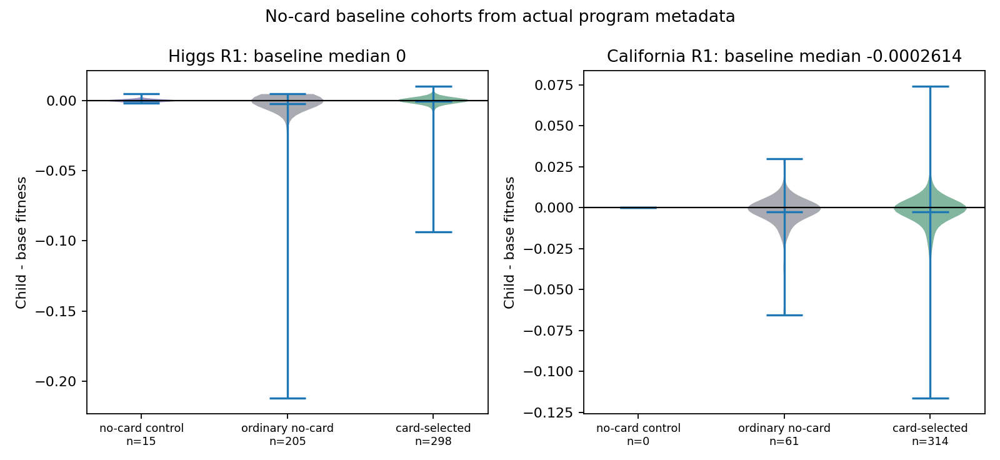

The Higgs R1 disk records had 15 randomized no-card controls; their median
child-base delta was 0. The California R1 parsed records had no randomized
controls, so the writer would use ordinary no-card rows; their median was about
`-0.0002614`.

The median can be zero when many invalid or non-improving children are present.
Invalid no-card children contribute zero to the baseline cohort; invalid
children that cited cards in `card_ids_used` contribute forced harm to those
used cards. Selected but uncited cards receive unused exposure events. The plot
is healthy when there is a visible no-card cohort; it is suspicious when the
cohort is empty, because valid direct card use cannot be baseline-adjusted yet.

## Selection Terminology

The code uses several different ids at different seams:

| Term / field | Meaning |
|---|---|
| `MEMORY_RESEARCH.candidate_ids` | Cards returned by agentic retrieval before auction. |
| `MEMORY_READ_SELECTION.candidate_ids` | Cards the reader priced after research/filtering. |
| `MEMORY_READ_SELECTION.auction_winner_ids` | Cards that passed EV and no-card-arm gates. |
| `MEMORY_READ_SELECTION.budgeted_ids` | Winners that survived `memory.reader.max_cards`. |
| `MEMORY_READ_SELECTION.selected_ids` | Cards rendered by the reader before randomized no-card withholding. |
| parent `memory_selected_idea_ids` | Cards actually exposed to `MutationSuggestionStage`; empty when no-card control fires. |
| child `memory_injected_idea_ids` | Union of actually exposed parent card ids frozen onto the child. |
| mutation output `card_ids_used` | Grounded ids the final mutation LLM claims it applied; this is the direct-credit signal. |

For single-parent runs, no-card control usually means the child has no injected
external card ids. In crossover/multi-parent settings, each parent can carry its
own slate, so inspect the child `memory_injected_idea_ids` when exact exposure
matters.

## Outcome Stamping

Before a child is born, `MemoryContextStage` overwrites parent-stage read
metadata on every NO_CACHE pass:

- `memory_candidate_slate`: auction audit records for this parent.
- `memory_selected_idea_ids`: actual external card ids passed to
  `MutationSuggestionStage`, after no-card control.
- `memory_no_card_control`: whether this parent's external card block was
  deliberately withheld.

When a child is born, mutation freezes the fields the writer will need later:

- `memory_injected_idea_ids`: actual external card ids exposed across all
  parents.
- `memory_used`: boolean telling whether the child had any injected external
  cards; it is not the same as `card_ids_used`.
- `memory_base_selected_idea_ids`: legacy/base-parent selected ids.
- `memory_base_metrics`: the base parent's metrics at birth.
- `memory_base_id`: the base parent id.
- `memory_no_card_control`: whether the named base parent's cards were
  intentionally withheld.
- `memory_lineage_applied_ids`: transitive closure for future lineage exclusion.
  This tracks cards the mutator actually cited as used, not every card merely
  exposed. Legacy non-structured mutations fall back to the full exposed slate.

Then the mutator's structured output may include `card_ids_used`. That is the
only signal that an external-card-derived suggestion was actually applied.

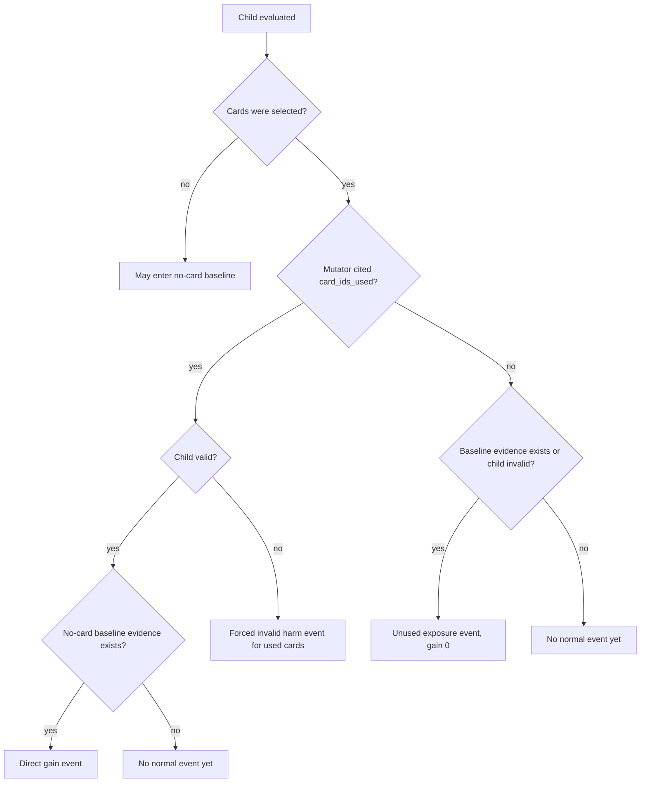

Selected but unused cards are important. They are not ignored in writer-enabled
runs; once baseline evidence exists, they get an `unused=True` zero-gain
exposure event. Invalid children emit forced invalid harm only for selected
cards cited in `card_ids_used`; selected cards the mutator did not cite get
unused exposure instead. Reader-only and static-memory runs do not run a writer,
so these child metadata fields remain useful for audit, but they do not update
the card bank in that run.

Restamping is authoritative, not append-only. Each writer sweep recomputes
selected-card events from the available program pool, preserves founding events
and external shared-bank events, folds absorbed-id aliases, then rewrites cards
whose event lists changed. That is why stale attributions can be cleared when
the pool no longer supports them.

## Reputation Posteriors

The base reputation model is a downside posterior: it estimates whether a
later-use introduction is not harmful. A direct gain below zero is harm. A direct
gain of exactly zero is not harm, but it also has no positive EV magnitude.
Unused and invalid exposures are forced failures even though their stored gain is
zero.

For a card's non-founding events:

```text
n = total effective event weight
k_harm = weight of events with gain < 0, plus invalid/unused forced failures
a = 1 + (n - k_harm)
b = 1 + k_harm
p_not_harm_mean = a / (a + b)
p_not_harm_lo20 = Beta(a, b).ppf(0.20)
```

The serialized field names are still `p_help_mean` and `p_help_lo20` for
compatibility, but the safer mental model is "probability this card is not
harmful." Renderer confidence and bootstrap EV then add the missing magnitude
check, so a no-op card is not shown as a confident positive lever just because it
was not harmful.

Cold cards have no usable posterior block, so `posterior_of(None)` returns the
cold prior:

```text
cold_prior = baseline_prior = Beta(3, 3)
```

That prior is deliberately neutral: it lets truly cold cards get occasional
exploration, but does not claim they are good.

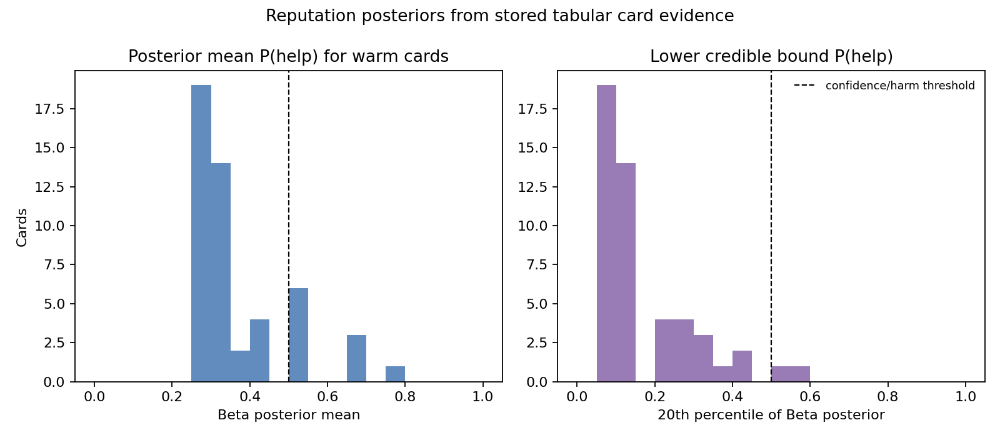

The histogram above is a global approximation from stored tabular card events.
In the real default reader, `BDProximityReputation` first tries the current
parent's behavior-space cell. If that cell has no non-founding EV support, it
falls back to global evidence; if the cell has local unused/invalid zero
exposure, that local evidence is used instead of falling back.

## Bootstrap EV And Fat-Tail Safety

A card can win often but fail catastrophically when it loses. The bootstrap EV
layer exists to see that.

For known cards, bootstrap EV samples from:

```text
direct baseline-adjusted deltas
+ zero atoms for invalid/unused later exposures
+ one neutral zero pseudo-event
```

For truly cold cards, it samples from:

```text
one borrowed cold gain scale
```

The cold gain scale is, in order:

1. Median positive warm magnitude in the current auction round.
2. The primary metric's `significant_change`.
3. `1.0` only in a degenerate scale-free round.

Known cards therefore do not borrow unrelated positive scale. Their own old
evidence fades toward zero, not toward optimism.

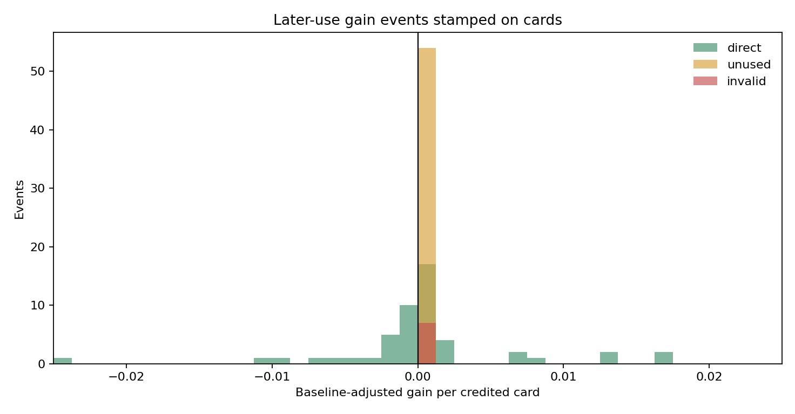

The gain histogram shows why the EV layer matters: losses and wins can have
different magnitudes. A sign-only posterior is not enough for prompt selection.

### Bootstrap versus eviction

Bootstrap is not "the evictor." It is the read-side value model that prices a
card before the mutator sees it. Eviction is the write-side deletion policy that
runs after evidence has been restamped onto cards.

The recommended system connects them deliberately:

| Mechanism | Runs when | Uses | Main effect |
|---|---|---|---|
| Bootstrap EV block | read/scoring time | non-founding gains, unused/invalid zero atoms, neutral pseudo-event, staleness weight | estimates expected card value and left-tail risk |
| Bootstrap fused bench | before retrieval/research | pessimistic bootstrap EV (`IntroGain_bootstrap_ev_lo20`) | keeps known weak warm cards out of the retrieval prompt |
| Bootstrap auction | after research | one live bootstrap EV bid plus Beta posterior draw | decides whether a candidate beats the no-card arm |
| Renderer | after budget | central/pessimistic bootstrap EV and posterior confidence | decides how strongly the card is described to the suggester |
| `PolicyNonViableEvictor` | write sweep after restamp | the same active value scorer, usually bootstrap EV mean | deletes warm cards that the active read policy now prices as non-viable |
| `HarmEvictor` | write sweep after restamp | downside Beta posterior only | deletes cards with repeated later-use failures |

That split is important. A single negative or unused exposure can make
bootstrap EV non-positive. The reader may then stop selecting the card, so it
may never collect the three failures required for a confident-harm posterior.
`PolicyNonViableEvictor` is the cleanup path for that common case: it asks
"would our current read policy still pay to show this card, and has it ever had
a positive direct baseline-adjusted use?" If the answer is no, the card can be
deleted without pretending we have a high-confidence harm theorem.

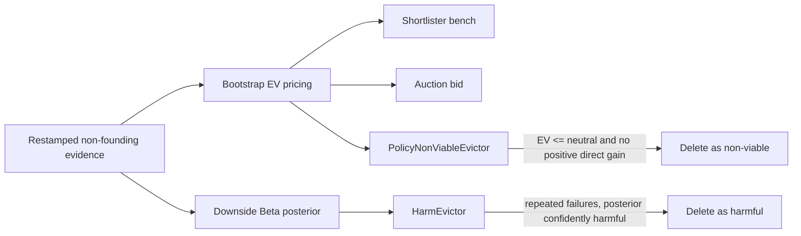

So "bad card cleanup" has two lanes:

1. **Policy non-viable:** common lane for one-bad-sample or ignored cards that
   the bootstrap reader would no longer select.
2. **Confident harm:** conservative backstop for cards that accumulate repeated
   later-use failures before policy retirement removes them.

## EV Staleness And Posterior Decay

The default bootstrap reputation uses bank-cycle staleness for EV evidence:

```text
s = number of gain events in the bank newer than this card's latest evidence
H = current_bank_card_count * half_life_cycles
w = 2 ** (-s / H)
```

With the default `half_life_cycles=1.0`, evidence one bank-wide turn old gets
half the bootstrap resample weight. A card with no stamped event timestamp gets
`w = 1.0`; there is no wall-clock decay without evidence timestamps.

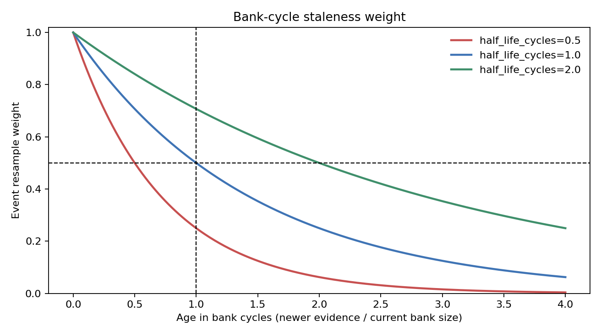

Under the default `bootstrap_bd` reputation, this staleness affects bootstrap EV
pricing, not the Beta harm posterior counts. Old positive EV evidence drifts
toward neutral zero; old negative EV evidence also drifts toward neutral zero.
The downside posterior used by `HarmEvictor` still counts the later-use evidence
unless a decay preset is selected.

The optional `*_decay` reputation presets wrap the inner reputation with
`DecayingReputation`. That variant discounts posterior counts as well:

```text
a_eff = 1 + w * (a - 1)
b_eff = 1 + w * (b - 1)
intro_events_eff = w * intro_events
```

So under explicit posterior decay, old harm evidence can also fall below the
`harm_min_events` requirement. This is not the `memory=full` default.

Decay does not delete a card. Deletion is handled by birth-failure eviction,
later-use harm eviction, and policy-non-viable active-bank cleanup.

## Auction Mechanics

The default `BootstrapThompsonAuctioneer` does this for each read decision:

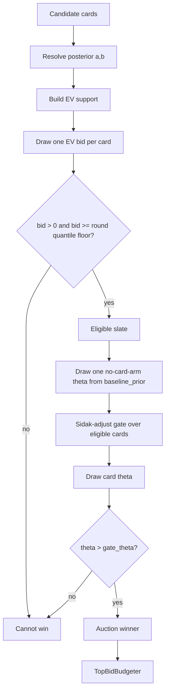

The default EV floor quantile is `0.765`. It is self-normalized to the current
round's own bid distribution. It is not a hardcoded metric delta. The no-card
arm here is the auction's fixed `baseline_prior`, not the fitted no-card
progress baseline used by the writer.

The budgeter only runs after the auction. If five cards win but
`memory.reader.max_cards=1`, only the highest realized EV bid reaches the
suggester.

### Bootstrap auction in words

For each candidate:

1. Resolve its posterior `(a, b)`. Cold cards use `Beta(3, 3)`.
2. Build its EV bid support.
   - Known card: its raw later-use direct deltas, zero atoms for invalid/unused
     exposure, plus one neutral zero pseudo-event.
   - Cold card: one borrowed positive cold-scale atom.
3. Draw one realized EV bid.
4. Reject it immediately if the bid is not positive.
5. Reject it if it falls below the round's `0.765` bid quantile.
6. For remaining eligible cards, draw one no-card arm from `baseline_prior` and
   Sidak-adjust that gate over the number of eligible cards.
7. Draw each card's theta from its Beta posterior.
8. Select the card only if theta beats the adjusted no-card-arm gate.
9. If too many cards win, keep the top realized EV bids.

That means cold cards do get exploration, but not free prompt access. They need
a lucky posterior draw, a positive borrowed-scale bid, and a no-card-gate win.

## Eviction

There are three deletion policies in the recommended evictor.

### BirthFailureEvictor

Deletes a card born from a catastrophically bad child before it can behave like
neutral cold advice.

It looks only at founding events and a task-scaled threshold. It can be rescued
only by later direct evidence:

```text
intro_events >= 3
p_help_lo20 > 0.5
selected rescue magnitude > 0
```

The selected rescue magnitude is `IntroGain_bootstrap_ev_lo20` when the
bootstrap field is present; otherwise it falls back to `IntroGain_best_median`.
With the recommended bootstrap reputation, a positive median alone does not
rescue a catastrophic birth if pessimistic bootstrap EV is non-positive.

### HarmEvictor

Deletes a card after later-use evidence says it is confidently harmful. It strips
founding events before scoring, because a card's origin is not proof of how it
behaves when injected later.

The default harm predicate is:

```text
intro_events >= 3
and Beta(a, b).ppf(0.80) < 0.5
```

So a single bad use does not delete a card through this path. This is
deliberately conservative and it is not the main cleanup mechanism for cards
that become unattractive after one negative or unused exposure.

With the recommended reader, confidently harmful deletion is expected to be
rare. A bad card may stop winning reads after its first non-founding evidence,
which means it may never collect three separate later-use failures. That is not
a bug in `HarmEvictor`; it is why the recommended evictor also includes
`PolicyNonViableEvictor`.

`HarmEvictor` still matters as a backstop when repeated failures arrive before
the active policy can bench the card. Examples:

- several children used or ignored the same stale card before the next live
  writer sweep restamped evidence;
- one writer sweep sees multiple already-evaluated children that selected the
  same card;
- invalid children provide forced failures for cited cards;
- a legacy or experimental read policy keeps sampling weak cards more
  aggressively than the recommended bootstrap stack.

### PolicyNonViableEvictor

Deletes a card that has left the useful active set without making the stronger
"confidently harmful" claim. It uses the same configured reputation/value stack
as the reader and checks non-founding, baseline-adjusted evidence only:

```text
has non-founding EV support
and active-policy EV <= neutral_gain
and no direct baseline-adjusted gain > neutral_gain
```

`neutral_gain` comes from the active memory preset as `memory.neutral_gain`; the
default is `0.0` because use-attributed gains are already centered on the
no-card counterfactual. This is not a task metric delta. A raw-negative child can
still save the card if it beats the no-card baseline and therefore stamps
positive card gain.

Mixed-sign cards are not deleted by this policy. If a card has ever produced a
positive direct baseline-adjusted gain, the system leaves it to normal
reputation, auction, and harm eviction.

This is the anti-zombie rule for the common case. After a card gets one bad
direct use, one ignored exposure, or one invalid-use failure, the bootstrap EV
can become non-positive and the reader may stop selecting it. Rather than
waiting for two more bad selections that may never happen, the eviction sweep
can retire it if it has no positive direct baseline-adjusted evidence.

## Evidence Maturity In Real Banks

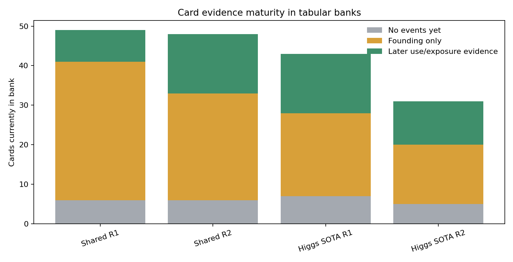

The tabular banks contain a mix of:

- no-event cards,
- founding-only cards,
- warm cards with later use or unused exposure evidence.

This is expected. A bank is not just a set of proven facts. It is a bounded
exploration surface where cold ideas can compete, warm ideas get priced, and bad
ideas are eventually benched or deleted.

## Zombie Cards

A "zombie card" can mean two different things.

The bad version is a card that is known to be harmful, keeps getting injected,
and never gets removed. The current system has several defenses against that:

- Later used-card outcomes become direct gain evidence when baseline evidence
  exists.
- Ignored cards become unused zero-gain exposure evidence.
- Invalid children give forced harm to cited/used cards and unused exposure to
  selected cards that were not cited.
- Non-positive warm EV cards are benched before retrieval by the bootstrap fused
  shortlister.
- The bootstrap auction has a positive-EV sign gate.
- `PolicyNonViableEvictor` deletes warm cards that the active read policy prices
  at non-positive EV and that have no positive direct baseline-adjusted use.
- `HarmEvictor` deletes cards whose later-use posterior is confidently harmful
  when repeated failures do accumulate.
- `BirthFailureEvictor` deletes catastrophic founding failures before they are
  treated as neutral cold cards.
- `LineageExcluder` prevents descendants from reusing cards the lineage actually
  cited as applied.

The harmless-but-annoying version is a cold card that was admitted, never
retrieved or never rendered to the suggestion stage, and therefore has no later
evidence. Such a card can remain in `cards.json`: there is no global TTL and no
hard insight-card count cap in the current default. It should not dominate
prompts because it is only visible through retrieval plus the auction's cold-prior
gates, but it can occupy bank/index space until merged, used, ignored, evicted
after evidence, or removed by a future admission policy.

So the precise guarantee is not "every unused card is evicted." The guarantee is
we do not keep serving a card as strong advice without evidence: cold cards stay
neutral, unused/invalid/negative cards get evidence, warm non-positive cards are
benched or retired as policy-non-viable, and repeated-failure cards can still be
deleted by the confident-harm backstop. The recommended system does not require
a bad card to be selected three more times after it already looks bad.

## Concrete Card Stories

| Card | Bank | What happened |
|---|---|---|
| `mem-e1c0bd7de695` | Higgs SOTA R1 | Insight: apply `log(1+x)` to heavy-tailed ratio features. It had 8 events: 1 founding, 4 direct, 3 unused. This is a warm, mixed-evidence card rather than a pure cold prior. |
| `mem-5bc4ac5f9cf0` | Shared R1 | Insight: train meta-learner on out-of-fold base predictions. It had 2 founding events and 2 later direct negative events, showing how a plausible card can accumulate negative later-use evidence. |
| `program-da609b0f-8b55-4cf4-a500-005eea4d57dc` | Higgs SOTA R2 | Program exemplar with 8 events: several unused exposures and later direct positive evidence. Program cards can be selected and credited just like insight cards. |
| `mem-07cea6e7547c` | Higgs SOTA R1 | Insight: use a single strong base model instead of a heterogeneous ensemble. It had 11 gain events, making it one of the better real examples for examining posterior updates. |

## All Major Lifecycle Branches

| Branch | Trigger | Stored evidence | Future behavior |
|---|---|---|---|
| Never born | Program not eligible for extraction | none | No memory effect |
| New insight | Librarian says `NEW` | Card with description, keywords, programs, founding event if available | Cold until later use evidence |
| Exact description twin | Normalized description already exists, including fallback prose | Existing card provenance updated | No new id, no duplicate founding evidence, novelty judge skipped |
| Idea ingest timeout | Librarian call exceeds timeout | Any partial landed cards are kept | Child record is retried on a later writer increment |
| Duplicate target exists | Librarian says `DUPLICATE` | Existing card provenance updated | No new card added; prior evidence stays as-is |
| Duplicate target missing/disallowed | LLM points at stale or ineligible target | Falls back to fresh admission when possible | Avoids silently dropping a useful idea |
| Merge target exists | Librarian says `MERGE` or consolidation folds pair | Survivor gains merged text/provenance/absorbed ids and keeps prior evidence | Children citing absorbed ids re-alias during restamp |
| Harmful merge | Merged union trips evictor | Ledger `evicted` / `rejected_harm` | Target is deleted/tombstoned |
| Program exemplar authored | Top valid program selected | `kind=program`, fitness, code hash, optional code | Competes like other cards |
| Program exemplar skipped | Authoring timeout/failure, tombstoned id, or equal/worse same-code twin | No new exemplar | Writer keeps moving without adding a duplicate |
| Better same-code exemplar | Same normalized code hash but higher fitness | Better twin admitted; older twin retired | Exact-code identity stays bounded |
| Exemplar cap pruning | `program_exemplars.max_cards` exceeded | Non-harm ledger update | Worst extra exemplar retired |
| Founding-only good | Birth child improved, no later use | Founding event only | Still cold for posterior; can be explored |
| Founding-only bad but not catastrophic | Birth child regressed mildly | Founding event only | Still cold unless later evidence appears |
| Catastrophic birth | Founding loss exceeds task-scaled threshold | Ledger `rejected_harm` or `evicted` | Deleted / tombstoned for the run |
| Cold and never retrieved | Retrieval never surfaces the card | No later evidence | Can remain in the bank; does not affect prompts unless recalled later |
| Excluded before research | Lineage or absorbed-id alias matches excluded ids | No gain event | Card remains in previous evidence state |
| Benched before research | Warm pessimistic EV is below floor or non-positive | No gain event | Card remains in previous evidence state but stops spending research slots |
| Retrieved but auction rejected | Research found card, bid/gate failed | Slate event only | No gain event; card remains as before |
| Retrieved but budget dropped | Too many auction winners | Budget event only | No gain event; card remains as before |
| Rendered but no-card control withheld | Random no-card control fires | Parent has `memory_no_card_control=True` and empty exposed ids | Enters no-card baseline cohort for that parent/base |
| Rendered in reader-only/static run | `memory=reader`, `memory=static`, or writer off | Child metadata only | Can affect child, but bank posterior/EV/eviction do not update in that run |
| Rendered and ignored | Mutator did not cite id | `unused=True`, gain 0 once baseline evidence exists or child invalid | Counts as exposure failure; not lineage-excluded as applied |
| Rendered and used | Mutator cited id | Direct baseline-adjusted gain, split across used cards | Warms posterior and EV |
| Rendered, cited, child invalid | Child invalid and id appears in `card_ids_used` | Forced invalid harm event | Can push toward eviction |
| Rendered, uncited, child invalid | Child invalid and id absent from `card_ids_used` | `unused=True`, gain 0 | Exposure failure, not direct invalid harm |
| Negative but sparse | Few negative or unused later events | Posterior/EV worse, but not enough for confident harm | Can be retired as policy-non-viable if EV is non-positive and no positive direct gain exists; otherwise benched or auction-rejected |
| Policy non-viable | Active value policy EV is at/below `memory.neutral_gain` and no direct adjusted gain is positive | Ledger `evicted` with `policy non-viable` reason | Deleted from active bank without claiming confident harm |
| Confidently harmful | Enough bad later-use evidence | Ledger `evicted` | Deleted from bank |
| Stale | Newer bank evidence accumulates | Same events, lower bootstrap weight | EV drifts toward neutral; not deleted |

## Reading The Logs

The fastest way to diagnose a run is to start with the reporting tools:

```bash
python tools/memory_event_report.py <run-dir-or-memory-dir>
python tools/memory_card_health.py <run-dir-or-memory-dir>

# Shared-bank run: join run-local events with shared-bank card/ledger files.
python tools/memory_event_report.py \
  --events <run>/memory/memory_events.jsonl \
  --cards <bank>/cards.json \
  --write-ledger <bank>/write_ledger.jsonl

# Shared-bank card-health audit.
python tools/memory_card_health.py <bank>
```

For a shared bank, artifacts are split across two places. Run telemetry lives in
the Hydra run output, usually `<run>/memory/memory_events.jsonl`. The bank itself
lives under `checkpoint_dir`, for example `/abs/bank/cards.json`,
`/abs/bank/chroma/`, and `/abs/bank/write_ledger.jsonl`. You often need both:
the run-local event stream explains what this run tried, while the shared bank
files explain what cards currently exist.

| Artifact | Meaning |
|---|---|
| `<run>/memory/memory_events.jsonl` | Per-read and per-write telemetry: research, auction, budget, restamp, eviction |
| `<bank>/cards.json` | Current cards and their gain events |
| `<bank>/write_ledger.jsonl` | Append-only history of add, merge, update, eviction, rejection |
| `<bank>/chroma/` | Vector index used by retrieval |
| `<run>/storage/<problem>/programs/*.json` | Child metadata used for no-card baseline and credit assignment |

Useful event names:

| Event | Question it answers |
|---|---|
| `MEMORY_RESEARCH` | Did retrieval return candidate cards? |
| `MEMORY_RESEARCH_STEP` | What queries and hits did the research loop use? |
| `MEMORY_AUCTION_RUN` | Which candidates bid, won, or lost? |
| `MEMORY_BUDGET_CAP` | Did the external card-block budget drop winners? |
| `MEMORY_READ_SELECTION` | End-to-end read result and `empty_reason` |
| `MEMORY_GAIN_RESTAMP` | Which cards received outcome events? |
| `MEMORY_EVICTION_SWEEP` | Which cards were deleted? |
| `MEMORY_STORE_WRITE` | Did store mutations persist? |
| `MEMORY_STORE_SYNC` | Did the vector index rebuild/sync with the bank? |
| `MEMORY_CONSOLIDATION_PASS` | Did near-duplicate consolidation run and merge anything? |

For "why was this card not sampled?", follow the read path in order:

1. Check `MEMORY_READ_SELECTION.exclude_ids` and
   `MEMORY_RESEARCH.exclude_count`. A lineage-applied card or any absorbed alias
   can be filtered before retrieval.
2. Check whether the bank is non-empty but `MEMORY_RESEARCH.outcome=empty` or
   `MEMORY_READ_SELECTION.empty_reason=research_empty`. That points to
   retrieval/index/task mismatch, digest/payload limits, or planner/reflector
   failures.
3. Check `MEMORY_RESEARCH_STEP.hit_ids`. If hits appear but
   `MEMORY_RESEARCH.candidate_ids` is empty, reflector selection or visibility is
   the likely bottleneck.
4. Check `MEMORY_READ_SELECTION.empty_reason=auction_rejected`. That is a reader
   empty reason, not a field inside `MEMORY_AUCTION_RUN`; inspect
   `MEMORY_AUCTION_RUN.winner_count`, `ev_floor`, and each `bids[].selected` /
   `bids[].bid`.
5. Check `MEMORY_BUDGET_CAP` and `MEMORY_READ_SELECTION.budgeted_ids` when
   several cards win but only one reaches the card block.
6. Check `MEMORY_READ_SELECTION.render_dropped_ids` for cards that survived
   budget but rendered empty.
7. Check parent `memory_selected_idea_ids` and child
   `memory_injected_idea_ids`. If reader `selected_ids` exists but these are
   empty, randomized no-card control likely withheld the external card block.
8. Check `mutation_output.card_ids_used`. If cards are exposed but never cited,
   later writer sweeps will produce unused exposure, not direct gain.

High `research_empty` with a non-empty bank is usually a retrieval or index
problem. High `auction_rejected` with candidates is often healthy abstention.
Selected cards with no direct events usually means the final mutator is not
citing `card_ids_used`. A growing bank with zero `MEMORY_GAIN_RESTAMP` credit
usually means attribution is blocked by no baseline evidence, no writer, or
unresolvable card ids.

## Common Mistakes

| Mistake | What happens |
|---|---|
| `pipeline=guided memory=writer` and expecting cards in the prompt | Writer-only fills a bank; it never installs `MemoryContextStage`. |
| `pipeline=memory_guided memory=reader` with no existing bank | Reads are enabled, but there is nothing useful to retrieve. |
| `pipeline=memory_guided memory=full` with default per-run bank and no `memory/write=live` | Config validation rejects it because the bank would be empty during reads. |
| Sharing one bank across incompatible problems, metric scales, or behavior spaces | Retrieval and reputation mix evidence that should not be comparable. |
| Disabling no-card control during validation | Attribution loses the cleanest baseline cohort. |
| Treating `MEMORY_READ_SELECTION.selected_ids` as final child exposure | It is emitted before no-card control; inspect child `memory_injected_idea_ids`. |
| Treating raw cards as final mutator prompt content | Raw cards feed `MutationSuggestionStage`; the final mutator sees grounded `ProgramInsights`. |

## Practical Interpretation

When a run is underperforming, ask these in order:

1. Is the bank mounted where you think it is? Compare run-local events with the
   actual `checkpoint_dir` bank.
2. Is retrieval empty? Check `MEMORY_READ_SELECTION.empty_reason=research_empty`,
   `MEMORY_RESEARCH_STEP.hit_ids`, and `MEMORY_STORE_SYNC`.
3. Is retrieval fine but auction abstains? Check
   `MEMORY_READ_SELECTION.empty_reason=auction_rejected` and bid values in
   `MEMORY_AUCTION_RUN`.
4. Did budget or rendering drop the card? Check `MEMORY_BUDGET_CAP`,
   `budgeted_ids`, and `render_dropped_ids`.
5. Are cards exposed but not used? Check child `memory_injected_idea_ids`,
   `mutation_output.card_ids_used`, and later `unused=True` events in
   `cards.json`.
6. Are cards used but baseline-adjusted gains negative? Check direct gain
   events and posterior histograms.
7. Are harmful cards deleted? Check `write_ledger.jsonl` and
   `MEMORY_EVICTION_SWEEP`.
8. Is the no-card progress baseline valid? Check whether randomized controls exist; if
   not, the system uses ordinary no-card rows.
9. Is BD reputation appropriate? Use `memory/read_policy=portable` when there is
   no shared behavior space or when multi-island compatibility rejects BD-local
   reputation.

The system is healthy when the bank is not exploding, read decisions often
abstain, exposed cards sometimes become direct-use events, unused cards get
penalized in writer-enabled runs, and harmful cards are either benched by EV or
eventually evicted.
